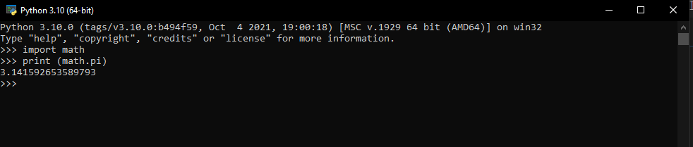

# menghitung-luas-keliling-lingkaran

## Belajar membuat program matematika menghitung luas dan keliling lingkaran di python

#contoh program python untuk menghitung luas maupun keliling lingkaran
berikut rumus luas dan keliling lingkaran

 ![img1]](screenshot/rumus_1.png)
 
 #dengan nilai phi yang kita gunakan adalah 3.14
saya mengimport modul math yang sudah disediakan oleh python.fungsinya agar kita dapat menyertakan nilai phi yang sudah tersedia dalam modul python dengan perintah math.pi, seperti gambar dibawah ini

  
  
  #dan program yang kita tulis sebagai berikut ini
  
   

   #dengan keterangan syntax \t merupakan espace atau untuk membuat tab, agar sama dengan didalam output sejajar dan berjarak.
hasil dari program yang kita tulis adalah sebagai berikut

   
   
   #dan dengan flowchart sebagai berikut
  
  
  #